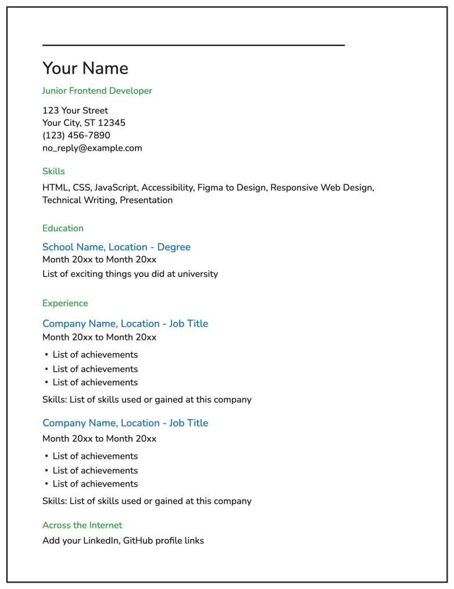

# Single-Page-CV
This project is part of the frontend development exercises of [roadmap.sh](https://roadmap.sh/projects/single-page-cv). The goal is to create a single-page CV (Curriculum Vitae) using only HTML.
--- 
Template :

## Key Requirements

Semantic HTML: Use appropriate HTML tags to structure your CV.

SEO Meta Tags: Include essential meta tags for SEO.

Open Graph (OG) Tags: Add OG tags for better social media sharing.

Favicon: Add a favicon for your CV page.